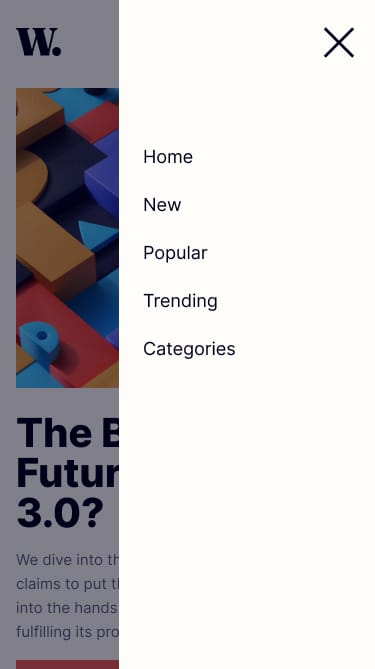

# Frontend Mentor - News homepage solution

This is a solution to the [News homepage challenge on Frontend Mentor](https://www.frontendmentor.io/challenges/news-homepage-H6SWTa1MFl). Frontend Mentor challenges help you improve your coding skills by building realistic projects.

## Table of contents

- [Overview](#overview)
  - [The challenge](#the-challenge)
  - [Screenshot](#screenshot)
  - [Links](#links)
- [My process](#my-process)
  - [Built with](#built-with)
  - [What I learned](#what-i-learned)
- [Author](#author)

## Overview

### The challenge

Users should be able to:

- View the optimal layout for the interface depending on their device's screen size
- See hover and focus states for all interactive elements on the page

### Screenshot

### Links

- [Solution]()
- [Live Site](https://news-homepage-pi-three.vercel.app)

## My process

### Built with

- Semantic HTML5 markup
- CSS custom properties
- Flexbox
- CSS Grid
- Mobile-first workflow
- [TypeScript](https://www.typescriptlang.org) - Programming Language
- [React](https://reactjs.org/) - JS library
- [Tailwind](https://tailwindcss.com) - For styles
- [Motion](https://motion.dev/docs/react-motion-component) - For Smooth Animations
- [hamburger-react](https://hamburger-react.netlify.app) - For animated hamburger menu icons

**Note: These are just examples. Delete this note and replace the list above with your own choices**

### What I learned

- Creating responsive navigation menus with hamburger-react.

## Author

- Frontend Mentor - [@firatyedibela](https://www.frontendmentor.io/profile/firatyedibela)
